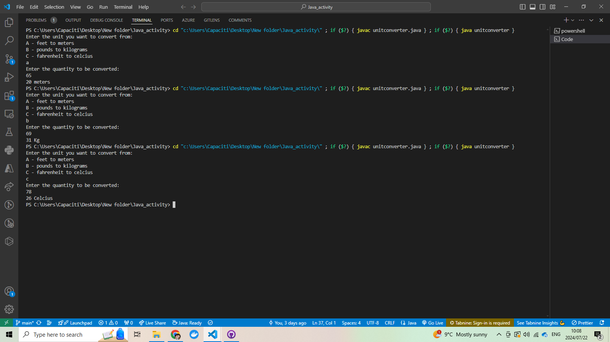

# Metric Converter

A console-based application that converts user-input quantities between specified units. It allows users to convert:

- Feet to Meters
- Pounds to Kilograms
- Fahrenheit to Celsius

## Prerequisites

To run the `UnitConverter` program in NetBeans, ensure the following prerequisites are met:

1. **VSCODE**:

   - Download and install the latest version of VSCode from [VSCode](https://code.visualstudio.com/download).

2. **Java Development Kit (JDK)**:

   - Download and install the latest JDK from [Oracle's official website](https://www.oracle.com/java/technologies/javase-downloads.html) or [OpenJDK](https://openjdk.java.net/install/).
   - Ensure the JDK is properly configured in your system environment variables. You can verify this by running `java -version` and `javac -version` in your command line.

3. **Basic Java Knowledge**:
   - Familiarity with Java programming, including classes, methods, and basic I/O operations.
   - Understanding of basic programming concepts such as loops, conditionals, and data types.

Once these prerequisites are met, you can create, compile, and run the `UnitConverter` program in VSCode without issues.

## Set up

git clone https://github.com/Odarell35/Java_activity.git

Open repository in vscode

- To run:

        javac unitconverter.java
        java unitconverter

## Screenshots

